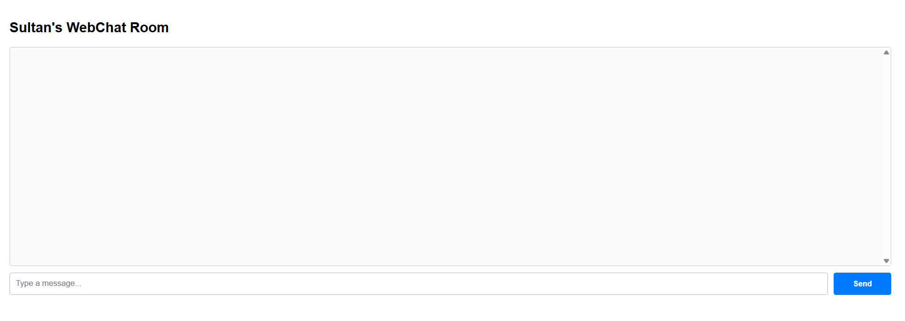
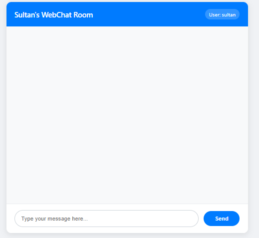

## run with trunk serve

# 1. Original Code

explanation: it supposed to have the chat that was sent but on this case problem hasnt been fixed. And this works by syncing the port 8080 with the one in broadcast chat.
So for this case the output is not done sadly :(. i hope i can still get points for this part. 

# 2. Creativity

:

For the design i implemented chatbox based on sending messages. As the backend sending the messages still doesnt work, will work on the other times as for now the yew app is not completely succeeed
Thanks

